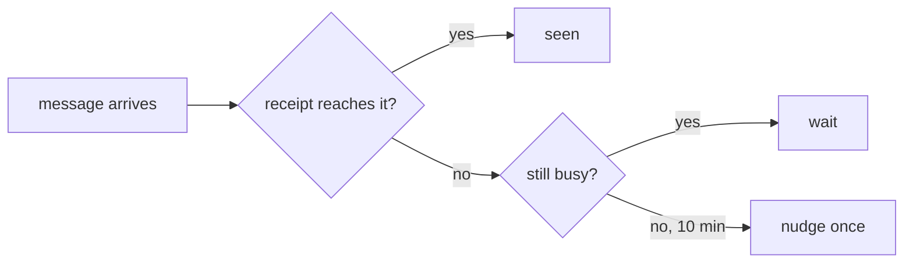
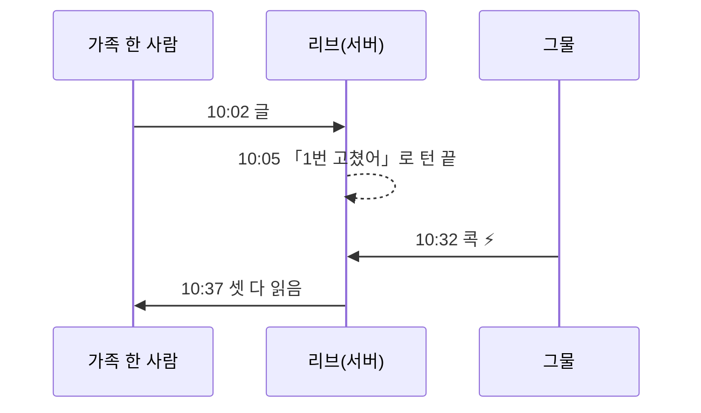

Test page for diagrams. Will be removed.

```mermaid
flowchart LR
  P[message arrives] --> C{receipt reaches it?}
  C -- yes --> S[seen]
  C -- no --> W{still busy?}
  W -- yes --> P2[wait]
  W -- "no, 10 min" --> N[nudge once]
```

한국어 라벨도 되는지:

```mermaid
sequenceDiagram
  participant 사람 as 가족 한 사람
  participant 리브 as 리브(서버)
  participant 그물
  사람->>리브: 10:02 글
  리브-->>리브: 10:05 「1번 고쳤어」로 턴 끝
  그물->>리브: 10:32 콕 ⚡
  리브->>사람: 10:37 셋 다 읽음
```
