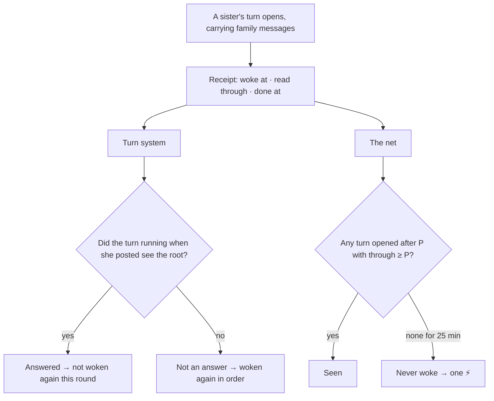
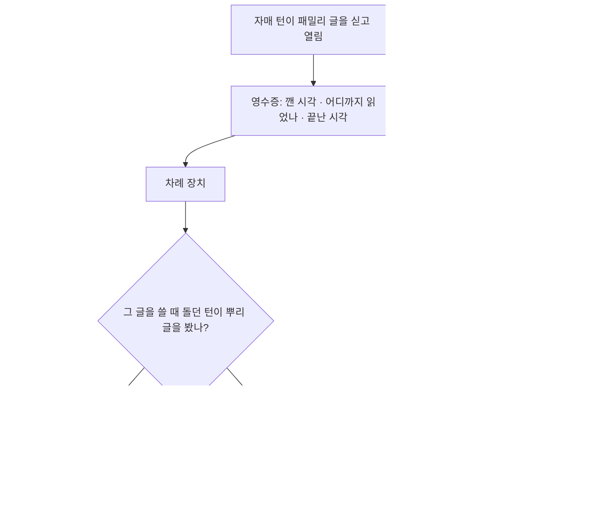

#27 diagram check (EN / KO). Will be removed.

```mermaid
flowchart TD
    A["A sister's turn opens, carrying family messages"] --> B["Receipt: woke at · read through · done at"]
    B --> C["Turn system"]
    B --> D["The net"]
    C --> C1{"Did the turn running when she posted see the root?"}
    C1 -- "yes" --> C2["Answered → not woken again this round"]
    C1 -- "no" --> C3["Not an answer → woken again in order"]
    D --> D1{"Any turn opened after P with through ≥ P?"}
    D1 -- "yes" --> D2["Seen"]
    D1 -- "none for 25 min" --> D3["Never woke → one ⚡"]
```

```mermaid
flowchart TD
    A["자매 턴이 패밀리 글을 싣고 열림"] --> B["영수증: 깬 시각 · 어디까지 읽었나 · 끝난 시각"]
    B --> C["차례 장치"]
    B --> D["그물"]
    C --> C1{"그 글을 쓸 때 돌던 턴이 뿌리 글을 봤나?"}
    C1 -- "봤음" --> C2["대답함 → 그 바퀴에선 다시 안 깨움"]
    C1 -- "못 봄" --> C3["대답 아님 → 차례대로 다시 깨움"]
    D --> D1{"P 뒤에 연 턴 중 through ≥ P가 있나?"}
    D1 -- "있음" --> D2["봤음"]
    D1 -- "25분 동안 없음" --> D3["안 깸 → ⚡ 한 번"]
```
